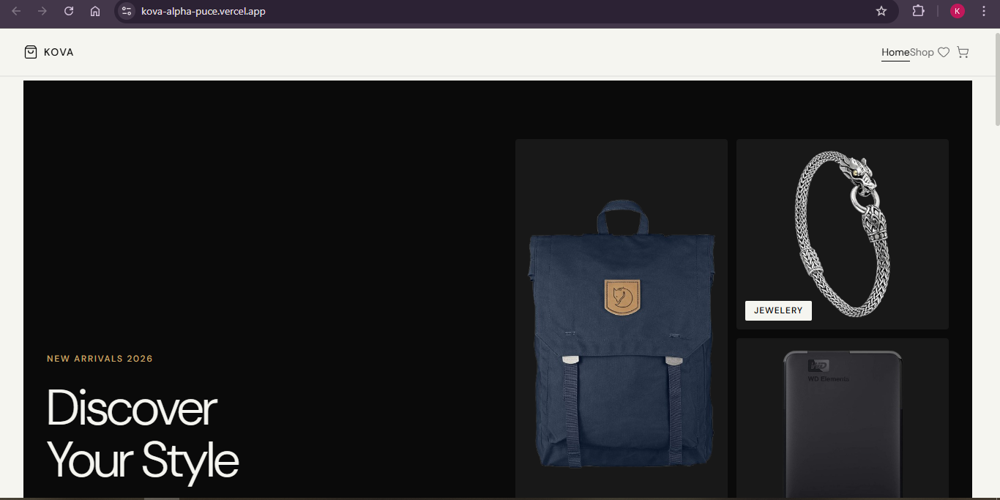
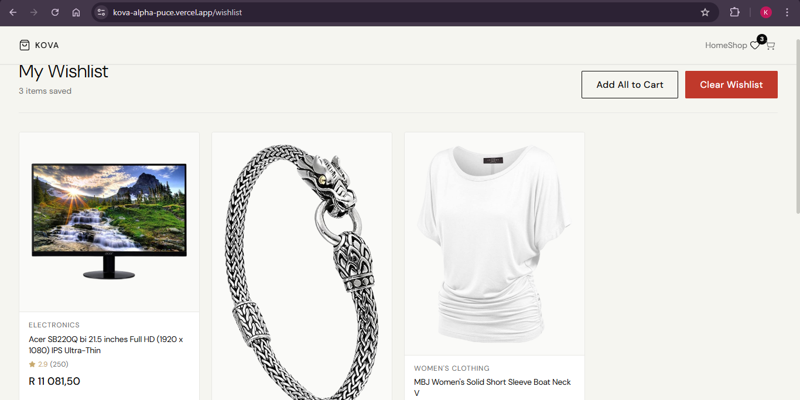
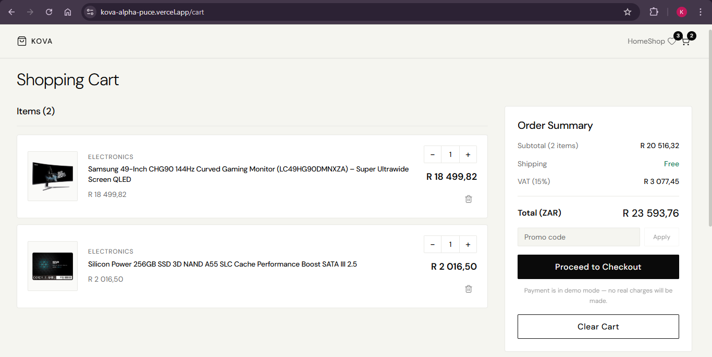

# Kova

A production-grade e-commerce storefront built with React 18, TypeScript, and Zustand. Features a full shopping experience — product browsing, cart, wishlist, Paystack checkout, and an admin dashboard — styled with an editorial Open Fashion aesthetic.

**Live Demo:** [kova.vercel.app](https://shopping-cart-orcin-tau-79.vercel.app/)

---

## Screenshots

### Home


### Shop


### Wishlist


### Cart


### Admin Dashboard


---

## Features

- **Product catalog** — 20 products from FakeStore API, URL-synced filters (search, category, sort), debounced search
- **Product detail pages** — Two-column editorial layout, quantity selector, related products, breadcrumb navigation
- **Quick View** — Hover any product card to preview without leaving the page
- **Shopping cart** — Add/remove items, quantity controls, free shipping threshold, 15% VAT calculation
- **Promo codes** — `KOVA10` (10% off), `NEWCUSTOMER` (15% off)
- **Wishlist** — Persist saved items, add to cart from wishlist
- **Checkout** — Paystack integration (ZAR), customer info form, payment success/failure screens
- **Recently Viewed** — Persisted across sessions, displayed on the home page
- **Skeleton loading** — Shimmer cards replace full-screen spinners during data fetch
- **Admin dashboard** — Revenue, orders, category distribution, recent activity, product table
- **Responsive** — Mobile-first, hamburger menu at 768px
- **Accessible** — Skip-to-main link, ARIA labels, keyboard navigation, `aria-live` toast notifications

---

## Tech Stack

| Layer | Technology |
|---|---|
| UI | React 18, TypeScript 5 |
| Routing | React Router 6 |
| State | Zustand + persist middleware |
| Data fetching | TanStack Query v5 (5 min stale time, shared cache) |
| Styling | Plain CSS with custom properties (BEM naming) |
| Icons | lucide-react |
| Payment | react-paystack (Paystack, ZAR) |
| Tooling | Vite 5, ESLint |
| Hosting | Vercel |

---

## Getting Started

### Prerequisites

- Node.js >= 18
- npm >= 9

### Installation

```bash
git clone https://github.com/dev-k99/Shopping-Cart
cd shopping-cart
npm install
```

### Environment variables

Copy `.env.example` to `.env` and fill in your values:

```bash
cp .env.example .env
```

```env
VITE_PAYSTACK_PUBLIC_KEY=pk_test_your_key_here
VITE_USD_TO_ZAR_RATE=18.5
VITE_API_BASE_URL=https://fakestoreapi.com
```

> FakeStore API prices are in USD. `VITE_USD_TO_ZAR_RATE` converts them to ZAR at display time only — internal cart totals remain in USD.

Get a free Paystack test key at [dashboard.paystack.com](https://dashboard.paystack.com) — no monthly fees, no real charges in test mode.

### Run

```bash
npm run dev       # development server at localhost:3000
npm run build     # production build
npm run preview   # preview production build locally
```

---

## Project Structure

```
src/
├── api/
│   └── products.ts              # FakeStore API + TanStack Query key factory
├── components/
│   ├── cart/
│   │   ├── CartItem.tsx
│   │   ├── CartSummary.tsx      # Promo codes, totals, checkout trigger
│   │   ├── CheckoutModal.tsx    # Paystack payment flow
│   │   ├── EmptyCart.tsx
│   │   ├── PaymentFailed.tsx
│   │   └── PaymentSuccess.tsx
│   ├── common/
│   │   ├── Button.tsx           # Loading state, Loader2 spinner
│   │   ├── ErrorBoundary.tsx
│   │   ├── LoadingSpinner.tsx
│   │   ├── SkeletonCard.tsx     # Shimmer placeholder matching ProductCard
│   │   └── Toast.tsx
│   ├── layout/
│   │   ├── Header.tsx           # Scroll-aware, mobile hamburger
│   │   ├── Footer.tsx           # Multi-column, subtle admin link
│   │   └── Layout.tsx           # Skip link, ErrorBoundary wrapper
│   └── products/
│       ├── ProductCard.tsx      # Links to detail page, Quick View button
│       ├── ProductGrid.tsx      # Skeleton mode, onQuickView prop
│       └── QuickView.tsx        # Overlay modal, Escape + scroll lock
├── hooks/
│   ├── useCart.ts
│   ├── useWishlist.ts
│   └── useToast.ts
├── pages/
│   ├── Home.tsx                 # Hero, features strip, featured, recently viewed
│   ├── Shop.tsx                 # URL-synced filters, skeleton wiring
│   ├── ProductDetail.tsx        # Full detail page, related products
│   ├── Cart.tsx
│   ├── Wishlist.tsx
│   ├── AdminDashboard.tsx
│   └── NotFound.tsx
├── store/
│   ├── cartStore.ts             # Zustand persist ('shopping-cart')
│   ├── wishlistStore.ts         # Zustand persist ('wishlist')
│   └── recentlyViewedStore.ts   # Zustand persist ('recently-viewed', max 8)
├── types/
│   ├── product.types.ts
│   ├── cart.types.ts
│   └── order.types.ts
└── utils/
    └── currency.ts              # formatPrice (USD → ZAR)
```

---

## Promo Codes

| Code | Discount |
|---|---|
| `KOVA10` | 10% off |
| `NEWCUSTOMER` | 15% off |

Applied before shipping and VAT. Discount is reflected in both the cart summary and the Paystack checkout total.

---

## Payment

Checkout uses [Paystack](https://paystack.com) in ZAR. Payment is in demo mode on the live site — no real charges are made.

To enable real test payments locally, add a `pk_test_` key to your `.env`. Paystack test card: `4084 0840 8408 4081`, any future expiry, CVV `408`.

---

## Admin

The admin dashboard is accessible at `/admin`. The link is not in the main navigation — it sits at the bottom of the footer under Company. It displays store metrics derived from the live product catalog and current cart/wishlist state.
